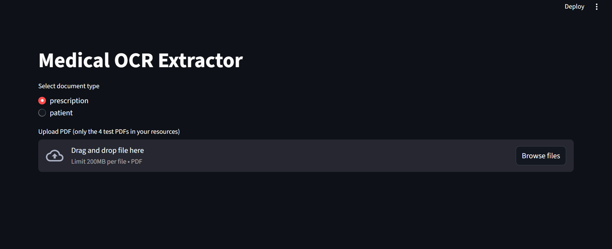
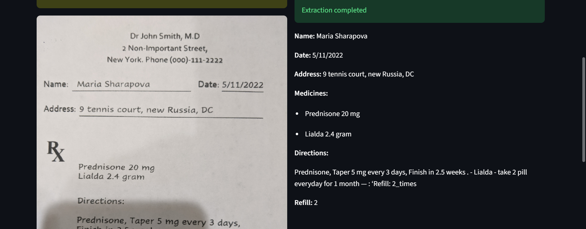

# 🏥 Medical OCR Extractor

OCR-based application built with **FastAPI** (backend) and **Streamlit** (frontend) that extracts **patient details** and **prescription information** from medical PDFs.  
It uses **Poppler**, **OpenCV adaptive thresholding**, and **Tesseract OCR** to process scanned PDFs.

---

## 📸 Demo Screenshot
Here’s how the app looks when running:

### PDF Upload & Extraction

### Extracted Patient Info

---

## 🚀 Features
- Upload **patient records** or **prescriptions** in PDF format
- Automatic OCR (OpenCV + Tesseract)
- Extracts:
  - Patient → **Name, Address**
  - Prescription → **Name, Address, Medicines, Directions, Refill**
- Clean modular code structure with regex-based extractors
- Streamlit frontend with PDF preview + backend API integration
- Unit tests for parsing logic

---

## 🛠️ Tech Stack
- **Python 3.10+**
- **FastAPI** – backend API
- **Streamlit** – frontend UI
- **Tesseract OCR** – text extraction
- **Poppler** – PDF to images
- **OpenCV** – adaptive thresholding
- **Pytest** – testing

---

## 📂 Project Structure
medical-project\
├─ backend # FastAPI backend\
│ ├─ app.py\
│ ├─ ocr_utils.py\
│ ├─ hospital.py\
│ └─ requirements.txt\
├─ frontend/ # Streamlit frontend\
│ ├─ streamlit_app.py\
│ └─ requirements.txt\
├─ tests/ # Unit tests\
│ └─ test_parsers.py\
├─ docs/ # Images\screenshots for README
│ └─ screenshot.png\
└─ README.md
